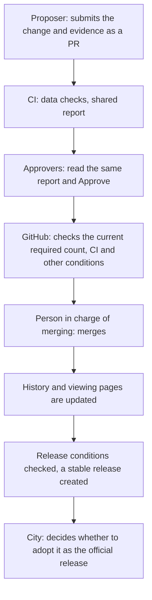

<!-- Copyright (c) 2026 4dcitygml -->
<!-- SPDX-License-Identifier: Apache-2.0 -->

# Processing flow for city staff: from proposal to approval and the official release

**Approvers read the shared CI report and the comparison views, and record their decision with
GitHub's Approve.** Contractors, city staff and their superiors use the same mechanism. There is
no operator-only confirmation button and no fixed two-stage approval procedure.

On every submission and update, CI generates the data checks, the requests for fixes, and a
report with change / evidence / checks / impact / recommendation. Nobody has to take over a
check or rewrite the report by hand.

> The city requires hub-v1.5.0 or newer (`min_hub` in `4dcitygml.json`); an older hub can view
> the city but cannot send proposals. The hub shows the `ci-report` check and the inspection rows
> of the shared report; the report text is read on the pull request in GitHub.

## 1. Who decides what

| Role | Responsibility |
|---|---|
| Proposer | Submits the change and its evidence. Cannot approve their own PR |
| CI | Runs the machine checks and generates the shared report |
| Approver (reviewer) | Reads the shared report and the comparison views and decides whether the change may be adopted. Contractors, city staff and others take part |
| Repository administrator | Manages permissions, the required approval count and the protection settings |
| Operator | Maintains the tools, answers questions, merges, releases. May also be an approver |

One account may both operate and approve. One account counts as one approval. Machines do not
guarantee that the evidence is sufficient or that the data matches the real building; people
judge that.

## 2. Before operation starts: agreement, setup, handover

Decide the target data, the source, the terms of use, the name under which it is published, the
contact point, the approvers, the required count and the handover conditions. Record the initial
data and its provenance, and set up required pull requests, required approvals, required CI
checks and so on.

At setup, check not only the normal path but also that a failed check, a missing or stale report
and too few approvals block the merge. Use different people as proposer and approver for the first
test, and do not take invalid test data in.

## 3. Everyday flow: from submission to merge

When a check fails, CI lists what to fix; once the proposer fixes it, re-inspection and report
generation run again. When a person finds a problem, they record Request changes with the reason.

Two steps need a maintainer before a PR can move on: a first-time contributor's checks start only
after a maintainer allows them (in the hub, the first-time acceptance), and a PR that changes
`.github/` needs the maintainer's `tooling` label after the change was read. See the
[operator handbook](operator-handbook.md), section 6.7, for the second.

Draft marks that the proposer is still working. CI runs on drafts too. When the work is ready, the
proposer marks it Ready. The editing tools create ordinary pull requests. There is no automatic
Draft / Ready switching based on the report.

## 4. Approval count

**The city can change the required approval count at any time to match its organisation.** An
administrator with the permission changes it and records the date, the count before and after,
and the reason. Pull requests under review are handled with the current setting.

The required count is based on the number of people who will take part in approving at that time,
not counting the PR's author. Every account with approval rights need not be treated as a
participant in every approval. Review the assignment and the count when someone is away or a
contract changes.

The hub does not read the required count and does not show how many approvals remain; it shows
each reviewer whether they approved and whether changes were requested. GitHub enforces the
count. "2 required" alone does not guarantee "one staff member and one superior". If a specific
team's approval is required, the city sets that separately, for example through Code Owners.

## 5. CI, approval records and the merge

| Condition | What it checks |
|---|---|
| `analyze` | Machine checks of data format, scope, references, geometry and so on. In operation, `CITYGML_STRICT_GATE=1` is required. Advisory rows (plausibility, minimal diff, topology, 3D view) are shown as warnings and do not block; approvers read them and judge |
| `ci-report` | Green: a report exists for the current proposal and the latest analysis, and it passes. Red, with the reason in the check's title: a fix is needed, a system failure, a workflow change waiting for the maintainer's review, or the report is not current yet |
| GitHub's approval rules | The current required count, approval permissions, and conditions such as Code Owners, the latest push and approval expiry |

GitHub does not count duplicate approvals by the same person, withdrawn approvals, or reviews by
accounts whose approvals do not count.

**Reaching the required count does not mean the PR can be merged.** GitHub also checks CI,
requested changes, resolved conversations, specific teams and other conditions; the PR page
shows which are still open.

An update of the proposal regenerates the CI report. Whether people's approvals expire follows
GitHub's settings; approvals are never withdrawn only because CI ran again. Automatic processing
is asynchronous, so check the latest results.

## 6. After approval: history, stable release, official release

**Approval, merge, the stable release and the city's adoption of an official release are separate
stages.**

| Stage | What changes | What to check |
|---|---|---|
| Approval | The staff's adoption decision is recorded on the PR | The data is not taken in yet |
| Merge | The change enters `main` and stays in the per-building history | The required checks and valid approvals are complete |
| Viewing and history update | The merge starts the update of the history index and the viewing pages | The operator checks that it succeeded; it does not necessarily finish with the merge |
| Stable release (Release) | The data of a chosen commit is released as a version for users | The operator checks the scope, sources, open items, check results and that the release matches the commit |
| Adoption as the official release | The city adopts that output as its official release | Record the adopted version, the date and where it was published |

A merge does not replace a stable release already published. Seeing an update on the public
repository's `main` or on the viewing pages is different from an updated stable or official
release. Ordinary users are pointed to the adopted stable release.

The release frequency, the version naming and the conditions for the first stable release are
fixed separately before operation starts. The annual release checks are the operator's checklist
([operator handbook](operator-handbook.md), section 8.2); CI does not run them.

If an error is found after a merge, the operator creates a PR that reverts or corrects it, and
checks the effect on releases already published and whether a corrected release is needed. The
history is normally not rewritten; the reason and course of the correction are kept. In an
emergency, an exception to the protection rules is decided by the city's administrator, with the
reason recorded.

## 7. Continued operation and handover

The hub distinguishes waiting for the proposer's fix, automatic processing, processing failure,
waiting for the latest version to be merged in, a first-time contributor whose checks run once a
maintainer allows them, and waiting for review. The operator decides the next step for what
has been stuck for long. When the city's approver is away, the work passes to another designated
approver. A successful check never replaces a missing approver.

The city's administrator updates team membership and permissions when people change posts or a
contract ends. When the contractor changes, the city still decides the approvers and the required
count, and every approver still reads the same report.

For the detailed contract, see [PR operations](pr-operations.md); for the staff's actions, the
[approver guide](approver-guide.md); for checking the automatic report, merging and releasing, the
[operator handbook](operator-handbook.md).

## Proposals for rebuilds, splits and merges

A rebuild, split or merge is "one event = one PR", handling the IDs of the old and new buildings
together. For example, a proposal that deletes old A and B and rebuilds them as new C is not split
into three unrelated corrections. Ordinary attribute corrections stay one building at a time.

The proposer puts the event ID, kind, old / new IDs, reason, date the evidence was confirmed and the
evidence into one event record. CI checks the record's hash, the classification into
added / deleted / changed, that it matches the actual change, changes to buildings outside the
event, duplicate IDs, and mixed records or commits. The confirmation date is separate from the
approval date.

The automatic report also carries the old-to-new mapping and the evidence. CI guarantees that the
record and the data are consistent. Whether this is really one rebuild, split or merge, and whether
the evidence is sufficient, the staff judge from the same report and the comparison views. A
mapping without clear evidence is not settled by the number of IDs alone.

CI runs these checks with the tools release the city pins. The editing tools have no input for
rebuilds yet, so such a PR is prepared by hand ([operator handbook](operator-handbook.md), section
6.2). For the details, see the [event record specification and examples](https://github.com/4dcitygml/tools/blob/main/docs/lifecycle-events.md).

## Improving the shared processing, and asking for help

Problems in processing or checks that a city cannot solve alone can be raised through the
[4dcitygml consultation form](https://github.com/4dcitygml/tools/issues/new?template=tooling_consultation.yml).
Link existing issues or PRs if there are any; there is no need to write a separate report for the
shared work.

The semantic correction of an LOD0 FootPrint into a RoofEdge is in a trial stage for limited
editions and conditions. The meaning changes even without changing coordinates, so the source's
evidence and the conditions of application must be checked. Use it only after the matching tools
release and the city CI version are aligned and the trial is complete. Posting the consultation
form does not yet run the processing or create a PR automatically.

See the [processing specification](https://github.com/4dcitygml/tools/blob/main/docs/lod0-semantic-correction.md)
and the [principles](https://github.com/4dcitygml/tools/blob/main/docs/principles.md).
